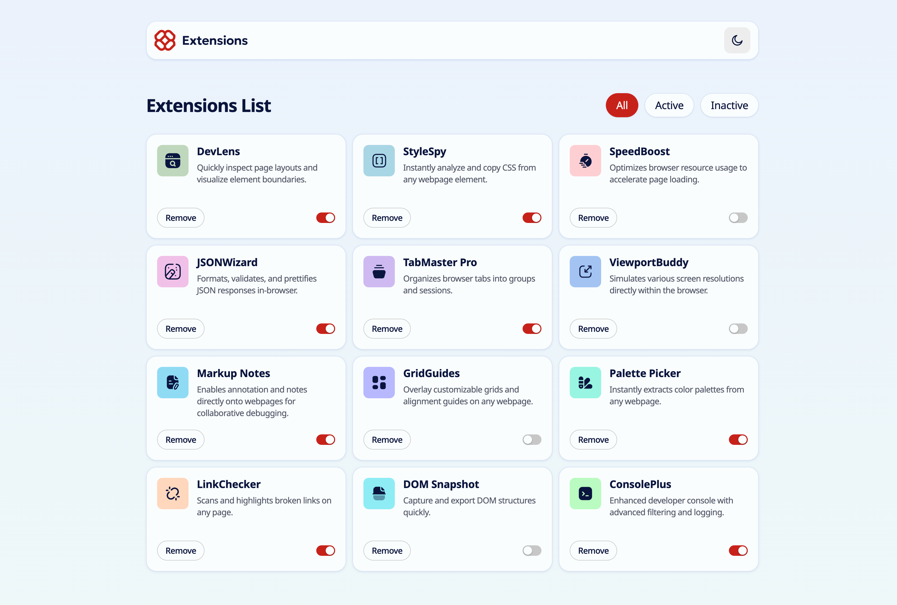

# Frontend Mentor - Browser extensions manager UI solution

This is a solution to the [Browser extensions manager UI challenge on Frontend Mentor](https://www.frontendmentor.io/challenges/browser-extension-manager-ui-yNZnOfsMAp). Frontend Mentor challenges help you improve your coding skills by building realistic projects.

## Table of contents

- [Overview](#overview)
  - [The challenge](#the-challenge)
  - [Screenshot](#screenshot)
  - [Links](#links)
- [My process](#my-process)
  - [Built with](#built-with)
  - [What I learned](#what-i-learned)
  - [Continued development](#continued-development)
  - [Useful resources](#useful-resources)
- [Author](#author)

## Overview

### The challenge

Users should be able to:

- Toggle extensions between active and inactive states
- Filter active and inactive extensions
- Remove extensions from the list
- Select their color theme
- View the optimal layout for the interface depending on their device's screen size
- See hover and focus states for all interactive elements on the page

### Screenshot



### Links

- [Solution URL](https://github.com/alibekmslv/browser-extensions-manager)
- [Live Site URL](https://browser-extensions-manager.massalimov.com)

## My process

### Built with

- Semantic HTML5 markup
- CSS custom properties
- Mobile-first workflow
- [Next.js](https://nextjs.org/) - React framework
- [Base UI](https://base-ui.com) – Unstyled UI components

### What I learned

One of the most interesting parts of this project was implementing the visibleExtensions state to manage which extensions should be displayed depending on the active tab (All, Active, or Inactive). Instead of immediately filtering the list when an extension’s status was toggled, I introduced a Set<string> to keep track of the visible extension names. This allowed me to improve the UX by ensuring that toggling the switch (e.g., deactivating an extension) wouldn’t cause the card to instantly disappear from view. The state is updated only when the tab is changed, which makes the interface feel more stable and less abrupt.

```tsx
const [visibleExtensions, setVisibleExtensions] = useState<Set<string>>(new Set())

useEffect(() => {
  if (activeTab !== previousTabRef.current) {
    const newVisibleExtensions = new Set<string>()

    extensions.forEach((extension) => {
      if (activeTab === "all") {
        newVisibleExtensions.add(extension.name)
      } else if (activeTab === "active" && extension.isActive) {
        newVisibleExtensions.add(extension.name)
      } else if (activeTab === "inactive" && !extension.isActive) {
        newVisibleExtensions.add(extension.name)
      }
    })

    setVisibleExtensions(newVisibleExtensions)
    previousTabRef.current = activeTab
  }
}, [activeTab, extensions])
```

### Continued development

In future projects, I’d like to deepen my understanding of React patterns and architecture. While working on this project, I realized how important it is to structure state management and component responsibilities clearly. I plan to explore patterns such as compound components, render props, and state colocation to improve maintainability and scalability in more complex applications.

### Useful resources

- [Base UI](https://base-ui.com) - I integrated the Switch component from Base UI and customized its appearance to match the design mockups.
- [next-themes](https://github.com/pacocoursey/next-themes) –  This library was used to add support for light and dark themes in a simple and efficient way.

All other components and styles were written entirely from scratch.


## Author

- Website - [Alibek Massalimov](https://massalimov.com)
- Frontend Mentor - [@alibekmslv](https://www.frontendmentor.io/profile/alibekmslv)
- Twitter - [@alibekmslv](https://www.twitter.com/alibekmslv)
